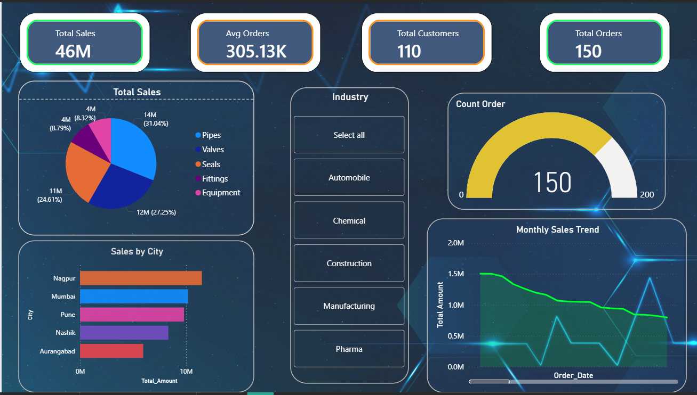
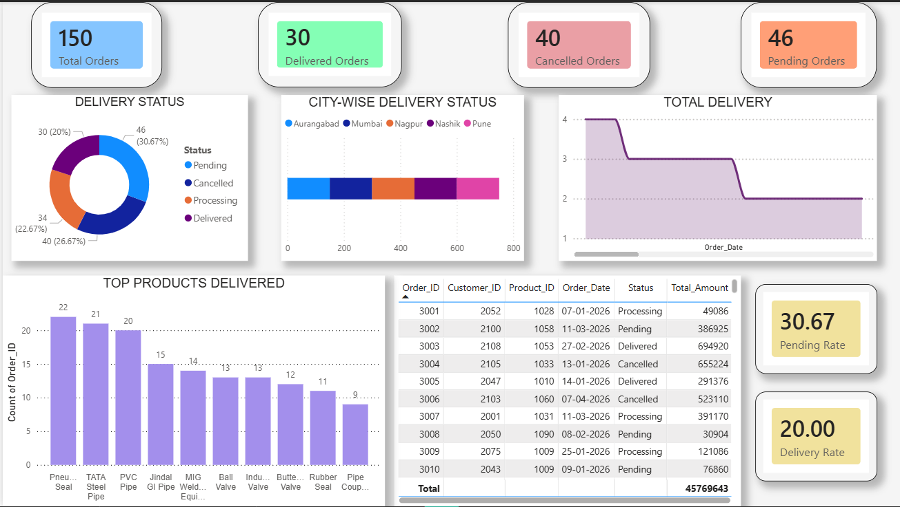
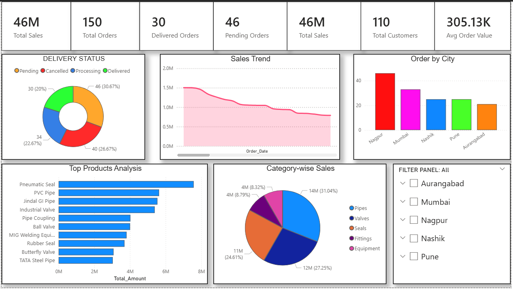

# Business Intelligence Sales Dashboard

## 📊 Project Overview

This project is an interactive Power BI dashboard developed to analyze Sales, Orders, Delivery Status, Customer Insights, and Product Performance.

The dashboard helps businesses monitor key performance indicators (KPIs), track delivery performance, identify top-selling products, and analyze sales trends for better decision-making.

---

## 🚀 Tools & Technologies

- Power BI
- Microsoft Excel
- DAX (Data Analysis Expressions)
- Data Modeling
- Data Visualization

---

## 📈 Dashboard Features

### KPI Cards
- Total Sales
- Total Orders
- Delivered Orders
- Pending Orders
- Total Customers
- Average Order Value

### Visualizations
- Delivery Status Analysis (Donut Chart)
- Sales Trend Analysis (Line Chart)
- Orders by City (Bar Chart)
- Top Products Analysis
- Category-wise Sales Distribution
- Interactive Filter Panel

---

## 📷 Dashboard Preview

### Main Dashboard

---

## 📊 Key Insights

- Total Sales: 46M
- Total Orders: 150
- Total Customers: 110
- Average Order Value: 305.13K
- Delivery status tracking across multiple order categories.
- Sales performance analysis by city and product category.
- Identification of top-performing products.

---

## 🎯 Business Benefits

- Monitor sales performance in real time.
- Track delivery and order status.
- Analyze customer and product behavior.
- Support data-driven business decisions.

---

## 📂 Project Structure

Business-Intelligence-Sales-Dashboard/

├── KP Sales.pbix

├── KP_Sales_Updated_Database.xlsx

├── README.md

└── Screenshots/

  └── Dashboard.png

---

## 👨‍💻 Author

**Samarth Dhangare**

- B.Tech (Computer Science & Engineering)
- Aspiring Data Analyst

GitHub: https://github.com/SamarthD01

---

## ⭐ Future Enhancements

- Customer Retention Analysis
- Profit & Loss Dashboard
- Inventory Monitoring
- Forecasting and Predictive Analytics
